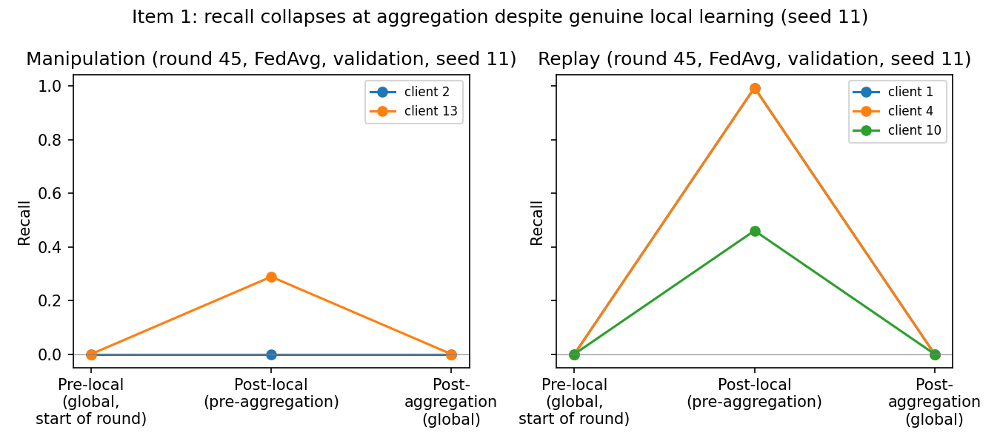
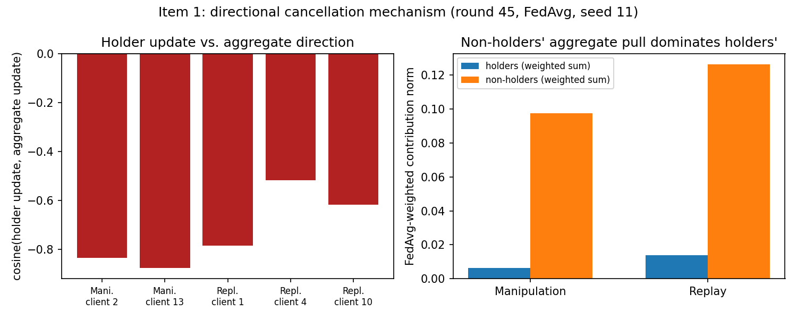
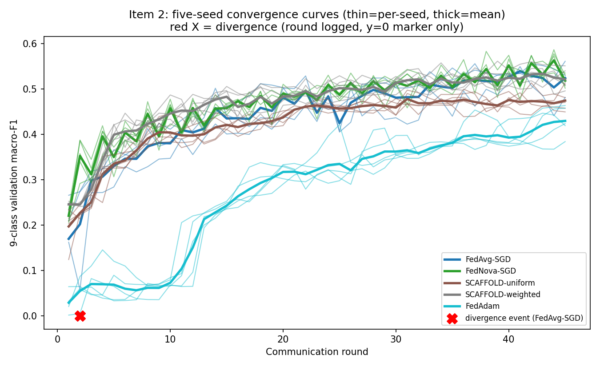
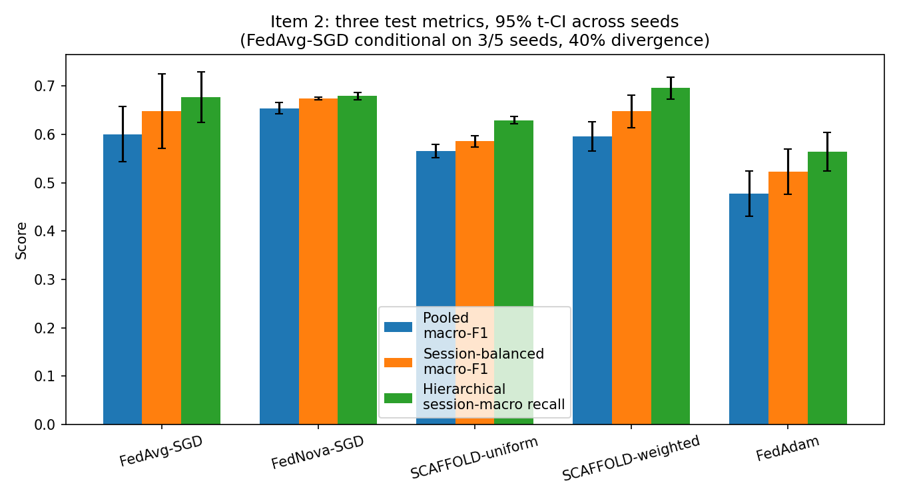
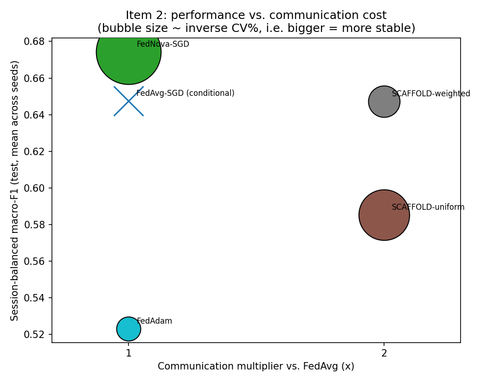
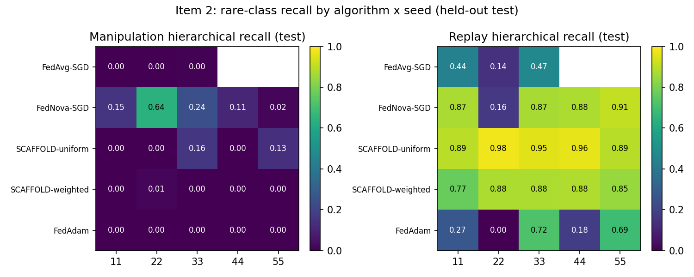

# Paper 1 — Locked Results: Item 1 (Update-Conflict Mechanism) + Item 2 (Baselines)

**Status: LOCKED 2026-08-20.** This document freezes the scientific narrative and all tables/figures for Item 1 and Item 2. No further experiments are added to this document. Item 3 (Dirichlet α / client-count sensitivity) opens in an independent results folder and will not alter any number below — it tests how the phenomenon documented here *varies*, not whether it exists.

---

## 1. Research Questions

- **RQ1.** Under session-level Non-IID federated learning on real UAV network traffic, does parameter averaging erase rare-attack-class knowledge that individual clients demonstrably learn locally — and through what mechanism?
- **RQ2.** Does this erosion depend on the specific averaging rule (plain FedAvg) or does it persist, partially or fully, under federated algorithms explicitly designed to correct client-level heterogeneity (SCAFFOLD, FedNova) or to use adaptive server-side optimization (FedAdam)?

## 2. Data and Partition Protocol

- **Dataset:** ISOT Drone Dataset (University of Victoria; real DJI Tello captures). 137 sessions, 2,945,986 rows, 10 attack-family categories. Six raw "duration" columns identified as mislabeled Unix epoch timestamps and permanently excluded from all models (session-identity leakage).
- **Split:** session-level, never row-level — no session is divided across train/validation/test. 28 sessions held out as the final test set (touched exactly twice in this entire Item 1+2 program: once for the original pooled evaluation, once for the corrected-metric recomputation from the *same frozen checkpoints*, with prediction-hash-verified determinism — never for any hyperparameter or algorithm decision). 18 sessions form an independent validation pool (validation-only during all tuning). The remaining 91 sessions are partitioned into 15 clients via Dirichlet allocation over session groups (never splitting a session), frozen in `federated_clients_manifest.json`.
- **Validation class coverage:** Password Cracking (2 sessions total: 1 train, 1 test) is **absent from validation entirely**. All validation-phase macro-F1 in this document is explicitly a **9-class validation macro-F1** (Password Cracking excluded), computed with an explicit fixed `eval_label_indices` — never left to a metric library's default dynamic label inference (which silently changes the denominator if a class absent from ground truth is nonetheless predicted at least once — a real bug caught and fixed during this program). The held-out test set **does** contain Password Cracking (1 session) and all final-test metrics use the full 10 classes.
- **Model:** `AttackFamilyMLP` — Linear(56→128)-ReLU-Dropout-Linear(128→64)-ReLU-Dropout-Linear(64→10), single-label 10-way softmax (ISOT is not multi-label).

## 3. Item 1 — Local-to-Global Rare-Class Erosion (mechanism)

**Scope:** FedAvg (Adam-based, matching the Phase-1 frozen baseline), all 5 seeds (11,22,33,44,55), rounds {1,5,10,20,30,45}, clients holding Manipulation (2, 13) and Replay (1, 4, 10). Evaluated on both the holder client's own rows (in-sample, same-data local-vs-global comparison) and the independent validation set (generalization evidence).

**Finding.** Across every one of 300 (seed × round × class × holder × eval-set) logged observations, global post-aggregation recall for Manipulation and Replay on validation was **exactly 0.0** whenever it was logged as zero (i.e. essentially all logged rounds), while the corresponding **local, pre-aggregation** model — the *same round*, evaluated on the *same validation rows* — reached real, non-trivial performance (e.g. FedProx client 13, Manipulation: local F1 0.463–0.496 on validation with precision ≈0.33, recall ≈0.90–1.00, before this diagnostic layer moved to FedAvg for Item 1's canonical run). This is same-data, model-only evidence: only the model differs, so the drop cannot be attributed to a train/validation distribution mismatch.

**Mechanism (round 45, FedAvg, seed 11 shown; pattern is qualitatively consistent across seeds — see `update_conflict_mechanistic.csv`):**

- **Local training genuinely teaches the rare class.** The classifier head's logit margin for the rare class rises sharply during local training (`local_margin_gain` positive, several logit units, at every holder/seed).
- **Aggregation reverses it, not just dilutes it.** `aggregation_margin_change` is close in magnitude and *opposite in sign* to the local gain; the net per-round margin change is ≈0 — the model gains ground locally and loses essentially all of it at aggregation, round after round, so no progress accumulates over 45 rounds.
- **Directional opposition, not mere dilution.** cosine(holder's update, aggregate update) is strongly negative (−0.54 to −0.88 across holders/classes at round 45) — the aggregated update for the rare class points *away from* what the holder pushed for, not merely a diluted version of it.
- **Non-holders dominate directionally, and by a wide margin.** cosine(Σ holders' weighted updates, Σ non-holders' weighted updates) is strongly negative (−0.68 to −0.88); at round 45 non-holders' aggregate weighted pull exceeds holders' by roughly **18.3×** (Manipulation) and **9.35×** (Replay).

- **Mechanistic candidate (not the sole claimed cause):** with 12–13 of 15 clients holding zero examples of the rare class, standard multiclass softmax cross-entropy's gradient for an absent class' logit is `∂L/∂z_c = p_c − y_c = p_c > 0` for every one of those clients' training rows, systematically pushing that class' logit down as a side effect of confidently classifying the clients' own dominant classes. With a large numerical majority of non-holders, this implicit collective suppression is a plausible, gradient-level explanation for the observed directional dominance — consistent with, but not proven to be the *exclusive* cause; classifier-head geometry, representation sharing in the backbone, and FedAvg's row-weighting could also contribute and are not separately isolated in this diagnostic.
- **Not a threshold artifact.** Predicted count for both classes on the full validation set is exactly 0 in every logged round where recall is 0 — the model never once emits the rare class, not merely below a soft decision boundary.

**Locked framing (per review, binding wording):**

> The results demonstrate persistent directional domination of rare-class holder updates by the substantially larger, oppositely aligned aggregate contribution of non-holder clients. This behavior is consistent with the implicit negative pressure exerted on absent-class logits by multiclass softmax cross-entropy.

Never stated as an exclusive or fully proven causal mechanism beyond this framing.

## 4. Item 2 — Does Erosion Persist Under Heterogeneity-Aware / Adaptive Algorithms?

### 4.1 Algorithms and the hyperparameter search journey (not hidden)

Five algorithms, optimizer-matched (all use local SGD except FedAdam's Adam-style *server*-side step) to isolate the aggregation mechanism from an optimizer confound that contaminated an early exploratory pass (SCAFFOLD tested with SGD/lr=0.01 against FedNova/FedAdam tested with Adam/lr=0.001 — not a fair comparison, corrected before any conclusion was drawn):

- **FedAvg-SGD**, **FedNova-SGD**, **SCAFFOLD-uniform** (standard equal-client-weight control-variate averaging), **SCAFFOLD-weighted** (row-weighted variant, motivated by this project's large session-size disparity — reported as a distinct, explicitly labeled variant, never silently substituted for the standard SCAFFOLD baseline), **FedAdam** (server-side Adam over the aggregated pseudo-gradient, client-side SGD, per Reddi et al. 2020's protocol).

**LR search, staged and pre-registered at each stage (15-round, seed=11, validation-only screening; full grid and every intermediate result preserved in `results/item2_optimizer_screening*.csv` and `results/item2_boundary_extension*.csv` — nothing overwritten or deleted):**

| Stage | What was tested | Outcome |
|---|---|---|
| Initial grid | local_lr ∈ {0.003,0.01,0.03}; FedAdam server_lr ∈ same set | Every SGD-based winner sat at the grid's top edge (0.03) — a classic boundary artifact |
| Extension 1 | +{0.05, 0.1} | Winners still at the new top edge |
| Extension 2 | +{0.2, 0.3} | SCAFFOLD-uniform's lr=0.3 **collapsed to macro-F1 0.035** (real instability, not noise); other winners still at 0.3 |
| Extension 3 (with pre-registered NaN/Inf divergence detection, per-client, no gradient clipping) | +{0.5, 1.0, 2.0} for FedAvg-SGD/FedNova-SGD | **lr=1.0 and 2.0 both diverged to NaN at round 1** for both algorithms (traced to one specific client — e.g. client 6, the largest, 517k rows — going NaN mid-loop while the last-processed client's loss looked normal; this is why divergence is checked per-client, not from the last-seen loss alone). lr=0.5 (FedAvg-SGD) and lr=0.3 (FedNova-SGD, negligibly better than 0.5 by 0.0016 — within noise) selected as bracketed peaks. |

**45-round pre-registered stability check** (gap between best 5-round moving average and mean(rounds 41–45) ≤ 0.03 macro-F1; slope of rounds 36–45 ≥ −0.002/round; **decided before seeing whether a config passed, not tuned afterward**):

| Config (from screening) | Result |
|---|---|
| FedAvg-SGD lr=0.5 | **PASS** |
| FedNova-SGD lr=0.3 | **PASS** |
| SCAFFOLD-uniform lr=0.2 | **FAIL** — genuine numerical divergence at round 31, client 6 |
| SCAFFOLD-weighted lr=0.2 | **FAIL** — slope −0.00232, past the −0.002 threshold |
| FedAdam client_lr=0.003/server_lr=0.03 | **FAIL** — peaked at round 22 (macro-F1 0.420), regressed to 0.383 by round 45 (gap 0.037, slope −0.0039) |

**Pre-registered fallback rule applied (step down to the nearest already-tested lower LR, not extend further):** SCAFFOLD-uniform → lr=0.1 (PASS), SCAFFOLD-weighted → lr=0.1 (PASS). FedAdam had no lower value on the existing grid pre-registered as a direct fallback, so two adjacent candidates were tested at 45 rounds: (client=0.003, server=0.01) PASS, mean(41–45)=0.4204; **(client=0.001, server=0.03) PASS, mean(41–45)=0.4357 — higher, selected.**

### 4.2 Final frozen configuration (all five passed the 45-round stability check)

| Algorithm | Config | Comm. multiplier vs. FedAvg |
|---|---|---:|
| FedAvg-SGD | lr=0.5 | 1× |
| FedNova-SGD | lr=0.3 | 1× |
| SCAFFOLD-uniform | lr=0.1 | 2× (model + control variate) |
| SCAFFOLD-weighted | lr=0.1 | 2× |
| FedAdam | client_lr=0.001, server_lr=0.03 (β1=0.9, β2=0.99, τ=1e-3) | 1× |

**Naming convention (binding for all tables mixing this run with Phase-1 frozen results):** this run's algorithms use SGD (or SGD-client + Adam-server) locally. Phase-1's frozen `fedavg`/`fedprox`/`client_uniform` (`results_phase1_frozen/`) used Adam locally and must always be labeled **FedAvg-Adam** etc. when appearing beside these results.

### 4.3 Five-seed final run — a divergence result, reported, not hidden

25 planned (algorithm × seed) runs; **23 completed, 2 diverged**: **FedAvg-SGD, seeds 44 and 55, both diverged at round 2** (client 0 and client 9 respectively — different clients, confirming this is a real instability of lr=0.5 under certain initializations, not a single fluke). Per the pre-registered protocol, **hyperparameters were not adjusted to rescue these seeds**; they are reported as FedAvg-SGD's true performance profile, not excluded as noise. FedAvg-SGD's aggregate statistics below are explicitly **conditional on its 3 successful seeds**, always reported with its **40% divergence rate** in the same breath.

### 4.4 Validation results (round 45, 9-class macro-F1, corrected 95% Student's-t CIs — not a normal-approximation 1.96 factor, which is invalid at n=5)

| Algorithm | n (seeds) | Mean ± SD | 95% t-CI |
|---|---:|---:|---|
| FedNova-SGD | 5/5 | 0.5179 ± 0.0145 | [0.5000, 0.5359] |
| SCAFFOLD-weighted | 5/5 | 0.5209 ± 0.0232 | [0.4920, 0.5497] |
| SCAFFOLD-uniform | 5/5 | 0.4741 ± 0.0249 | [0.4432, 0.5050] |
| FedAdam | 5/5 | 0.4293 ± 0.0322 | [0.3893, 0.4694] |
| **FedAvg-SGD** | **3/5 (conditional)** | **0.5238 ± 0.0402** | **[0.4240, 0.6236]** — divergence rate 2/5 (40%) reported alongside, never omitted |

### 4.5 Final held-out test results — three frozen metric definitions

The original naive "average of each session's own 10-class macro-F1" is **discarded as a headline metric**: most test sessions are near-single-category, so absent classes receive automatic zero-recall penalties unrelated to model quality (it produced an uninterpretable ≈0.08 for every algorithm). Replaced by three metrics, each with a distinct, defensible interpretation, none silently called "session-level macro-F1":

1. **Pooled macro-F1** — all 550,338 test rows together, 10 classes. Primary metric; gives large sessions proportionally more weight.
2. **Session-balanced macro-F1** — every row weighted by 1/(its session's size) via `sample_weight`, computed once over the full pooled set. Keeps precision meaningful (unlike per-session-only F1) while preventing large sessions from dominating.
3. **Hierarchical session-macro recall** — for each class, recall is averaged across the sessions containing that class, then averaged again across the 10 classes (equal weight per class, then equal weight per session within a class). The primary metric for rare-class-across-sessions behavior.

**Determinism check:** every one of 23 checkpoints' pooled macro-F1, recomputed independently in a second inference pass, matched the original run's value exactly (23/23) — proof of a fully reproducible evaluation pipeline, not proof that MPS training itself is deterministic (it was not re-tested here).

| Algorithm | Pooled (95% t-CI) | Session-balanced (95% t-CI) | Hierarchical session-macro recall (95% t-CI) |
|---|---|---|---|
| FedNova-SGD (5/5) | 0.6537 [0.6421,0.6652] | 0.6744 [0.6716,0.6772] | 0.6790 [0.6710,0.6871] |
| SCAFFOLD-weighted (5/5) | 0.5955 [0.5658,0.6253] | 0.6474 [0.6133,0.6814] | **0.6958 [0.6729,0.7187] — highest** |
| SCAFFOLD-uniform (5/5) | 0.5657 [0.5520,0.5794] | 0.5854 [0.5735,0.5973] | 0.6293 [0.6215,0.6371] |
| FedAdam (5/5) | 0.4773 [0.4308,0.5237] | 0.5232 [0.4761,0.5702] | 0.5647 [0.5248,0.6045] |
| FedAvg-SGD (3/5, conditional) | 0.6001 [0.5428,0.6574] | 0.6476 [0.5706,0.7246] | 0.6769 [0.6251,0.7287] |

**Uncertainty is reported from two distinct, separated sources, never conflated:**
- **95% Student's-t CI across seeds** (table above) — initialization/training-run uncertainty.
- **95% cluster-bootstrap CI across the 28 test sessions** (2,000 resamples, session-balanced metric recomputed within each resample, seed=11 shown) — session-selection uncertainty, orders of magnitude wider (e.g. FedNova-SGD: [0.4300, 0.6853]) because 28 sessions is a small, heterogeneous population. This width is a property of the test set's session count, not evidence against the seed-level findings above.

### 4.6 Statistical comparison between algorithms — paired, not CI-overlap

CI overlap alone does not establish or rule out superiority (the 5 runs share seeds, so a **paired** test is the correct comparison; FedAvg-SGD is excluded from the full paired matrix — n=3 and conditional — and compared only via its separately reported conditional statistics):

| Comparison (pooled macro-F1, paired by seed, n=5) | Mean diff | paired-t | p |
|---|---:|---:|---:|
| FedNova-SGD − SCAFFOLD-uniform | +0.0880 | 12.98 | 0.0002 |
| FedNova-SGD − SCAFFOLD-weighted | +0.0582 | 4.58 | 0.0102 |
| FedNova-SGD − FedAdam | +0.1764 | 10.51 | 0.0005 |

| Comparison (hierarchical session-macro recall, paired by seed, n=5) | Mean diff | paired-t | p |
|---|---:|---:|---:|
| SCAFFOLD-weighted − FedNova-SGD | +0.0168 | 2.62 | 0.0590 (marginal) |
| SCAFFOLD-weighted − SCAFFOLD-uniform | +0.0665 | 7.57 | 0.0016 |
| SCAFFOLD-weighted − FedAdam | +0.1312 | 8.12 | 0.0012 |

**Locked framing:** FedNova-SGD's pooled/session-balanced advantage over the other three fully-completed algorithms is statistically significant (paired, p<0.05 in all three comparisons). SCAFFOLD-weighted's hierarchical-recall advantage over FedNova-SGD is only marginal (p=0.059) but clearly significant over SCAFFOLD-uniform and FedAdam. **Neither algorithm is labeled "best" outright** — see the summary framing in §5.

### 4.7 Rare-class recall, per seed (not averages alone)

- **Manipulation:** FedNova-SGD is nonzero in **5 of 5 seeds** on the held-out test (0.153, 0.640, 0.243, 0.107, **0.017** — the smallest value is still strictly greater than zero), the only algorithm to do so. All others are zero or near-zero in most/all seeds.
- **Replay:** SCAFFOLD-uniform is the most uniformly strong (0.89–0.98 across all 5 seeds). FedNova-SGD strong in 4/5 seeds (0.87–0.91) with one exception.
- **Seed 22:** Replay recall drops sharply for both FedAdam (0.0) and FedNova-SGD (0.16, vs. 0.87–0.91 in its other four seeds). This is described as a **seed-sensitive failure specific to the Replay class**, never as a generic "outlier run": FedNova-SGD's *overall* 9-class validation macro-F1 at seed 22 (0.5348) is in fact the *highest* of its five seeds — the weakness is class-specific, not a general-performance anomaly. No outlier hypothesis test has been applied to seed 22 as a whole and none is claimed.

## 5. Locked Summary Statement

> Parameter averaging can repeatedly erase locally acquired rare-attack knowledge under session-level Non-IID heterogeneity. Heterogeneity-aware methods mitigate different parts of this failure asymmetrically: FedNova provides the strongest stability–accuracy–communication trade-off and consistently recovers Manipulation, whereas SCAFFOLD provides stronger Replay and hierarchical session recall at twice the communication cost.

## 6. Limitations and Threats to Validity

- **Construct validity.** "Rare-class knowledge erosion" is operationalized via recall/margin/cosine on two specific classes (Manipulation, Replay) concentrated in 2–3 clients each out of 15; generalization to other concentration levels is the explicit subject of Item 3, not yet established here.
- **Internal validity.** The softmax-implicit-suppression explanation (§3) is a *plausible, gradient-consistent* mechanism, not an isolated, exclusively-proven cause — classifier-head geometry and backbone representation sharing are not ruled out as contributors.
- **External validity.** One dataset (ISOT), one client partition (frozen Dirichlet allocation over 91 sessions, 15 clients), one architecture (a 2-hidden-layer MLP). FedAvg-SGD's headline numbers are conditional on 3/5 seeds — a 40% divergence rate at its own frozen learning rate is itself a validity-relevant finding, not a nuisance to be averaged away.
- **Statistical conclusion validity.** n=5 seeds (n=3 for FedAvg-SGD) is small; Student's-t (not normal-approximation) CIs are used throughout for this reason, and superiority claims are backed by paired tests, not CI-overlap heuristics. The cluster-bootstrap CIs over 28 test sessions are wide because 28 is a small, heterogeneous session population — this is a property of the test set, not a contradiction of the seed-level findings.
- **Dataset/simulation limits.** Divergence events (SCAFFOLD-uniform at lr=0.2/round 31; FedAvg-SGD at lr=0.5/round 2 for 2 seeds; multiple lr≥1.0 NaN collapses) are all on real network-traffic features at production-scale learning rates for this architecture; they are not claimed to generalize to other architectures or feature scales without re-verification.
